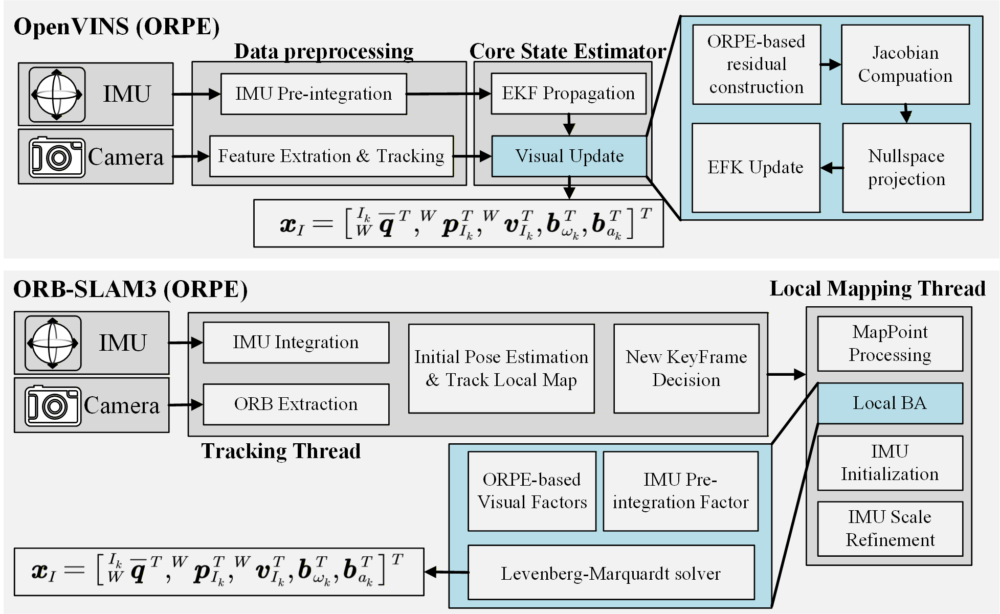

# Orthogonal Ray Projection (ORPE)

**Orthogonal Ray Projection: A Tangent-Space Visual Measurement Model for Robust Visual-Inertial Odometry**

[](https://www.gnu.org/licenses/gpl-3.0)
[](https://github.com/rpng/open_vins)
[](https://github.com/UZH-RPG/ORB_SLAM3)


This repository contains the official source code for the paper **"Orthogonal Ray Projection: A Tangent-Space Visual Measurement Model for Robust Visual-Inertial Odometry"**, submitted to **IEEE Robotics and Automation Letters (RA-L)**.

We provide implementations integrated into two state-of-the-art frameworks:
1.  **OpenVINS-ORPE**: Based on the MSCKF filter-based framework.
2.  **ORB-SLAM3-ORPE**: Based on the optimization-based SLAM framework.

Note: The full source code is currently being organized and cleaned. It will be fully open-sourced here immediately upon the acceptance of the paper.
---

## 📖 Abstract

The reprojection error in Visual-Inertial Odometry (VIO) suffers from high nonlinearity due to perspective division, which degrades estimator consistency and robustness, particularly under large depth uncertainty. To address this, we propose a novel visual measurement model, the Orthogonal Ray Projection Error (ORPE), which is formulated in the tangent space of the observation ray. By minimizing the orthogonal distance between the estimated landmark and the measurement ray, ORPE eliminates the explicit dependency on scalar depth, rendering the residual function linear with respect to the feature position. We derive the exact analytical Jacobians and uncertainty propagation model, integrating ORPE into both the MSCKF-based OpenVINS and the optimization-based ORB-SLAM3 frameworks. Simulations confirm that ORPE renders the measurement model linear regarding feature position, while reducing nonlinearity with respect to camera pose. Extensive real-world experiments demonstrate that the proposed method significantly improves trajectory accuracy and estimator consistency in challenging weak-parallax scenarios, while maintaining computational efficiency comparable to standard approaches.

<p align="center">
  
  <br>
  <em>Fig. 1: System overview of the integrated frameworks. Top: OpenVINS (ORPE) with modified MSCKF update. Bottom: ORB-SLAM3 (ORPE) with Orthogonal Ray Factor.</em>
</p>


## 📂 Repository Structure

The code is organized into two main sub-directories corresponding to the modified frameworks:

```bash
.
├── OpenVINS-ORPE/       # Modified OpenVINS implementation
│   ├── ov_core/         # Contains the ORPE-based MSCKF Update logic
│   ├── ov_msckf/        # ROS wrapper and launch files
│   └── ...
├── ORB-SLAM3-ORPE/      # Modified ORB-SLAM3 implementation
│   ├── src/             # Core SLAM logic including Orthogonal Ray Factor
│   ├── include/         # Header files for ORPE formulation
│   └── ...
└── README.md
